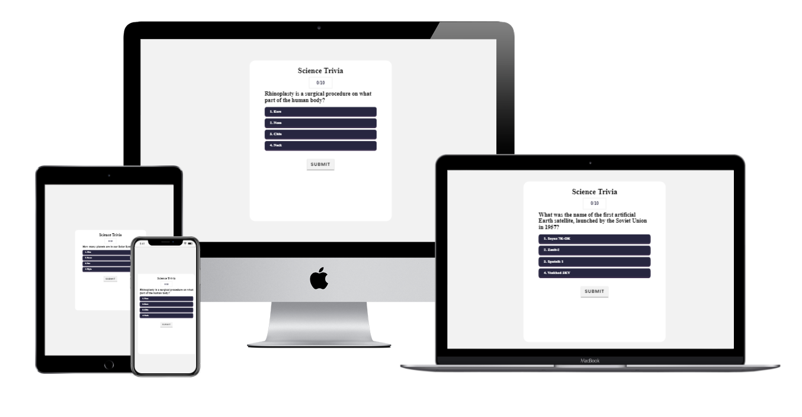

# Code Institute Second Milestone Project

## Science Trivia Quiz

## Introduction

This website is a trivia quiz with science based questions. The user will answer 10 questions and receive a score out of 10.

## User Experience (UX)

### User Stories
   The user story for this project is very simple. That is to have fun while playing a game and maybe learn some new facts.

### Design
   A simple design has been used focusing on making the game intuitive to play.

   - Typography
      
      The primary font that has been used across the website is Poppins, Serif has been used as a back up font in case the primary font fails to load.

## Technologies Used
   
### Languages
   - [HTML5](https://en.wikipedia.org/wiki/HTML5)
   - [CSS](https://en.wikipedia.org/wiki/CSS)
   - [JavaScript](https://developer.mozilla.org/en-US/docs/Web/JavaScript)

### Frameworks, Libraries, and Other Resources
   2. [Google Fonts](https://fonts.google.com/):
      - Google fonts was used to import the 'Poppins' font.
   5. [GitPod](https://www.gitpod.io/):
      - GitPod was used for version control by utilizing the Gitpod terminal to commit to Git or Push to Github.
   6. [GitHub](https://github.com/):
      - GitHub is used to store the projects code after being pushed from Git.
   7. [Balsamiq](https://balsamiq.com/):
      - Balsamiq was used to create the wireframes during the design process.
   9. [Open Trivia Database](https://opentdb.com/)
      - Open Trivia Database Api was used to pull trivia questions into the quiz.

### Testing
    
#### Browser Testing

The website has been tested in Google Chrome, Microsoft Edge, Safari and Firefox. The websites works as intended across these different browsers.

It has been tested on two mobile devices a Huawei and Samsung. The website works as intended on both devices.

#### Local Testing

I have tested all the buttons and played through the game. It works as expected except for an error with duplicate questions, explored further in the issues section.

#### Validators

The websites has been through the W3C validators with 0 errors and x warnings.

- [Index](assets/images/htmlValidator.png)
    Running index.html through the W3C validator showed no errors but it did display a warning. This is connected with an empty h2 however, this element is populated using 
    JavaScript and the Open Database Trivia Api.

- [CSS](assets/images/cssValidator.png)

- [JavaScript](assets/images/javscriptvalidator.png)
    There is one warning regarding async functions. However, this is that async functions are only available in ES8 but there is no option to configure JsHint to test for ES8 features.

#### Responsivenes

I have tested the responsiveness of the website using Chrome Dev Tools. Everything works accordingly and is responsive across different devices.

#### Lighthouse testing

[Quiz](assets/images/lighthousetesting.png)

#### Issues

Sometimes the questions can repeat themselves within the same game. I believe this may be an issue with the api as I have not been able to find the cause within my code.

#### Improvements

I had initially planned to used the Astronomy Picture of the Day Api within the project. This would be accessed after getting a perfect score on the quiz as a reward. As this
the quiz is based around science trivia it would have fit thematically. Due to time consraints I was not able to do this but it is something that could be included in future developments of the site.

There is currently only one difficulty level although the api provides three. Allowing the user to change the difficulty could be a future improvement made to the site.

A further improvement could be adding a social media factor to the website. For example it could be linked to your Facebook profile and you could challenge friends to see who gets the best score.

### Version Control

#### Git & GitHub

I used GitPod as an IDE and Github as a remote reposiory.

- To start with I created a respository on GitHub using Code Institutes
template.
- I then opened the repository in GitPod where I wrote my code.
- The code written in GitPod was pushed to GitHub.

### Deployment

I deployed the website on GitHub pages using the following steps:

   1. Go to "Settings" in your respository.
   2. Select "Pages" from the left hand menu.
   3. Select the branch and folder then save.
   4. The website is now running on GitHub pages.

### Sources
1. (https://www.youtube.com/watch?v=SgJ_femmsfg)
2. (https://www.w3schools.com/)
3. (https://www.youtube.com/watch?v=-cX5jnQgqSM&t=767s)
4. (https://developer.mozilla.org/en-US/docs/Web/JavaScript)
5. (https://www.youtube.com/watch?v=3aKOQn2NPFs)